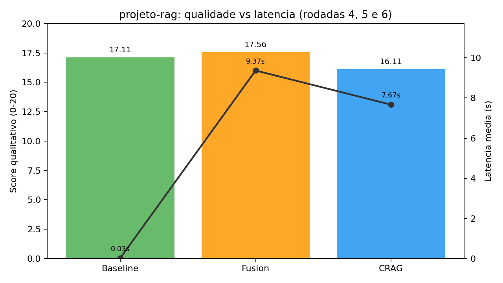
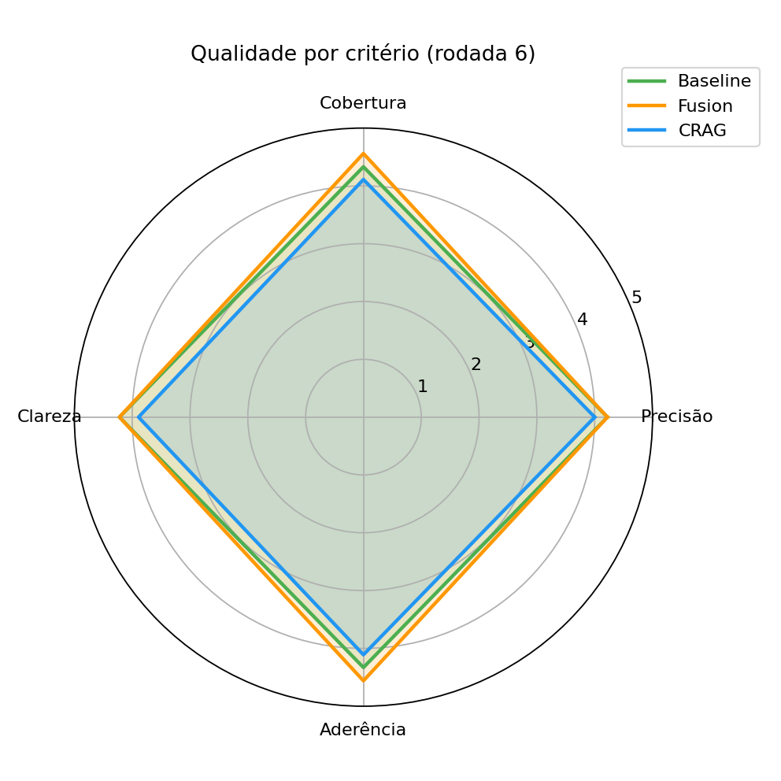
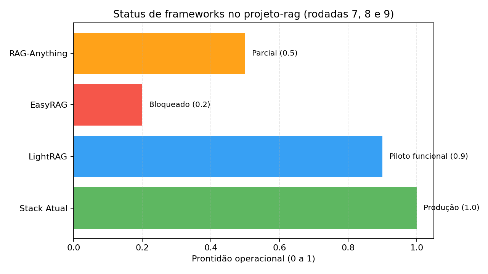

# projeto-rag

> Laboratorio pratico de RAG para uso real: ingestao de base autoral, benchmark comparativo e operacao diaria.

## Visao geral
Este repositorio consolida um ciclo completo de engenharia de RAG:
- ingestao de conhecimento em colecoes vetoriais dedicadas,
- comparacao tecnica entre estrategias de retrieval,
- avaliacao qualitativa cega das respostas,
- preparo de material para publicacao tecnica (artigo).

## Objetivo
Construir uma base de conhecimento **solida, auditavel e reutilizavel** para IA aplicada, com foco em:
- qualidade de resposta,
- latencia operacional,
- robustez em perguntas ambiguas,
- continuidade de evolucao (baseline -> fusion -> crag -> agentic).

## Resultados ja obtidos



### Base de conhecimento
- 9 colecoes vetoriais dedicadas (`sandeco_*_v1`)
- 2480 chunks ingeridos

### Benchmarks
- **Rodada 4 — Baseline vs Fusion**
  - baseline: ~0.03s
  - fusion: ~9.37s
  - novelty@8 do fusion: ~0.19

- **Rodada 5 — Fusion vs CRAG**
  - fusion: ~9.27s
  - crag: ~7.67s
  - novelty@8 do crag vs fusion: ~0.22

- **Rodada 6 — Avaliacao qualitativa cega**
  - baseline: 17.11/20
  - fusion: 17.56/20
  - crag: 16.11/20



- **Rodada 7 — Piloto LightRAG (framework externo)**
  - escopo: `sandeco_rag_book_v1`, 3 perguntas, 80 chunks amostrados
  - baseline: 16.67/20 | 18.38s
  - LightRAG: 16.00/20 | 37.58s
  - status: piloto inicial concluido (indicador, nao decisao final)

## Uso diario (chat RAG)
Script operacional:
- `scripts/rag_daily_chat.py`

## Ingestao multiformato (dual sink: Obsidian + Chroma)
Script operacional:
- `scripts/ingest_dual_sink.py`

Exemplos:
```bash
cd "/home/ecode/Documents/projetos/projeto-rag/sources/rag_memory/02 - RAG with memory"
source .venv/bin/activate

# Ingerir documentacao web (crawl limitado ao dominio)
python /home/ecode/Documents/projetos/projeto-rag/scripts/ingest_dual_sink.py \
  --source-type web \
  --source-name fastapi_docs \
  --collection docs_fastapi_v1 \
  --url https://fastapi.tiangolo.com/ \
  --max-pages 60 \
  --max-depth 2

# Ingerir pasta de arquivos locais (pdf/docx/xlsx/html/...)
python /home/ecode/Documents/projetos/projeto-rag/scripts/ingest_dual_sink.py \
  --source-type file \
  --source-name contratos_2026 \
  --collection files_contratos_2026_v1 \
  --input-path "/home/ecode/Documents/contratos"
```

Saidas:
- bruto auditavel no Obsidian (`10 Fontes Brutas/Web` ou `10 Fontes Brutas/Documentos`)
- indice vetorial no Chroma (colecao escolhida)
- manifesto JSONL por lote + estado incremental em `analises/ingest_state/`

Exemplos:
```bash
cd "/home/ecode/Documents/projetos/projeto-rag/sources/rag_memory/02 - RAG with memory"
source .venv/bin/activate

# Modo rapido (padrao recomendado)
python /home/ecode/Documents/projetos/projeto-rag/scripts/rag_daily_chat.py --mode baseline --collection auto

# Modo expansao semantica
python /home/ecode/Documents/projetos/projeto-rag/scripts/rag_daily_chat.py --mode fusion --collection auto

# Modo corretivo
python /home/ecode/Documents/projetos/projeto-rag/scripts/rag_daily_chat.py --mode crag --collection auto

# LightRAG (sem Neo4j, com roteamento automatico)
python /home/ecode/Documents/projetos/projeto-rag/scripts/rag_daily_chat_lightrag.py --collection auto --mode hybrid
```

## Integracao com pi-coding-agent (tools locais)
Para uso diario no `pi`, existe uma extensao local em `.pi/extensions/rag-obsidian-tools.ts` com:
- `list_rag_collections`: lista colecoes do Chroma local
- `ask_rag`: retrieval local no Chroma (`collection=auto|all|sandeco_*_v1`)
- `ingest_rag_source`: ingestao dual sink (web ou arquivos) para Obsidian bruto + Chroma indexado
- `track_work_event`: telemetria manual leve do trabalho (sem LLM)
- `analyze_work_patterns`: analise de padroes e gargalos diretamente dos eventos (sem LLM)

Scripts base usados pela extensao:
- `scripts/rag_retrieve_local.py`
- `scripts/ingest_dual_sink.py`

Telemetria operacional no Obsidian:
- `90 Operacao/Telemetria/events.jsonl` (registro continuo)
- `90 Operacao/Telemetria/Diario/YYYY-MM-DD.md` (resumo diario automatico)
- `90 Operacao/Telemetria/Relatorios/` (analises por periodo)

Observacoes:
- Nao depende de API HTTP separada para retrieval.
- Requer o ambiente Python do baseline em `sources/rag_memory/02 - RAG with memory/.venv`.

## Estrutura do repositorio
- `scripts/`: automacoes de ingestao, benchmark e operacao
- `analises/`: resultados, comparativos e rascunho de artigo
- `downloads/`: artefatos brutos locais (**ignorado no git**)
- `sources/`: codigo extraido/local de terceiros (**ignorado no git**)

## Arquivos-chave
- `analises/ingestao-lote-livros-sandeco.md`
- `analises/benchmark-baseline-vs-fusion.md`
- `analises/benchmark-fusion-vs-crag.md`
- `analises/avaliacao-qualitativa-cega-rodada-6.md`
- `analises/artigo-rascunho-rag-v1.md`
- `analises/material-artigo-rag.md`

## Seguranca e privacidade
Este projeto segue politica explicita de versionamento:
- **Nao publicar** PDFs/livros, fontes brutas e artefatos protegidos.
- **Nao publicar** `.env`, tokens e credenciais.
- Publicar apenas codigo proprio, scripts e resultados analiticos.

## Reproduzir os graficos
```bash
cd "/home/ecode/Documents/projetos/projeto-rag/sources/rag_memory/02 - RAG with memory"
source .venv/bin/activate

python /home/ecode/Documents/projetos/projeto-rag/scripts/plot_benchmark_overview.py
python /home/ecode/Documents/projetos/projeto-rag/scripts/plot_quality_radar.py
python /home/ecode/Documents/projetos/projeto-rag/scripts/plot_frameworks_status.py
```

## Proximos passos
- rodada de validacao com frameworks externos (LightRAG, EasyRAG, RAG-Anything)
- desenho de orquestracao adaptativa de producao
- consolidacao final do artigo tecnico

### Roadmap frameworks externos
1. **LightRAG (piloto)**: concluido (rodada 7)
2. **EasyRAG (piloto)**: rodada 8 de viabilidade concluida (bloqueado no ambiente atual)
3. **RAG-Anything (fase avancada)**: validar ganho multimodal/grafo
4. Decisao de adocao: so promover se melhorar ao menos 2 eixos sem degradar os demais

#### Estado atual dos externos
- LightRAG: piloto funcional executado com benchmark controlado.
- EasyRAG: piloto funcional bloqueado por requisitos de ambiente (GPU/dependencias/provider padrao GLM).
- RAG-Anything: rodada 9 de viabilidade concluida com status `pilot_partial` (faltam MinerU/LibreOffice/GPU no ambiente atual).
- Proximo externo recomendado: repetir piloto funcional do RAG-Anything em ambiente dedicado multimodal.



---
Se este projeto te ajudou, abra uma issue com sugestoes de experimento ou benchmark adicional.
